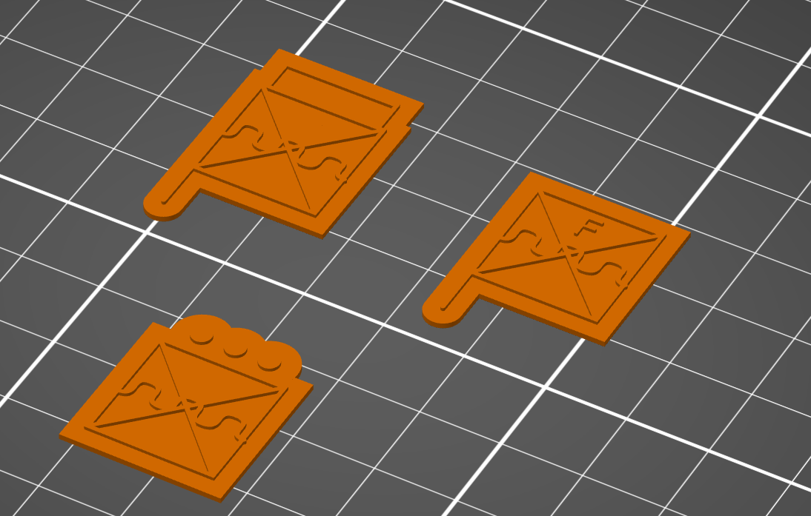

# Military symbol SVG token generator

This is a small utility to generate 3D-printable STL tokens of military symbols for use in wargames and training applications. This is intended to be used as a command line application and has been tested on Linux, though it should work with a suitable environment on Mac or Windows as well. If you're on Windows, I recommend using the Windows Subsystem for Linux functionality.

## Dependencies

To use, you'll need the following applications and libraries:

- The [Python military-symbol library](https://pypi.org/project/military-symbol/) (also available on [GitHub](https://github.com/nwroyer/Python-Military-Symbols)). This is used to translate NATO APP-6 symbol codes (SIDCs) (such as those you can get on the great [Spatial Illusions milsymbol generator](https://spatialillusions.com/unitgenerator/#30031500001102010000)) or natural-language names into SVG files.
- [Inkscape](https://inkscape.org/): The open source vector graphics editor. This is used to prepare the generated SVG files for a format that can be converted into STLs.
- [Blender](https://www.blender.org/): The open-source 3D program. This is used to generate the STL files from an SVG file.

Ensure Blender and Inkscape are both able to be run from the command line with `blender` and `inkscape` commands.

## Usage

Edit the `items.txt` file to have one item per line. These items can be either a SIDC like `130315000011020100000000000000` or a name like `friendly infantry platoon`. Note that the system will use the names as a best-guess mechanism, and may not be entirely accurate for more complex unit types - I recommend using SIDCs instead for more precision.

Once you have the text file prepared, navigate to this folder in your command line and run the `svg_to_stl.py` script, e.g. `python ./svg_to_stl.py`. You should see text scrolling by that indicates the progress of each step; no manual intervention is required.

Upon completion, you'll have the STL files available in the `STLs` folder. 

Note that if you're loading the files in PrusaSlicer, you'll get a message reading "The dimensions of the object from file [filename] seem to be defined in meters. The internal unit of PrusaSlicer is a millimeter. Do you want to recalculate the dimensions of the object?"

Select Yes for this. If your slicing program does not support this, you'll need to scale your tokens appropriately according to your software.

## Altering sizes

To increase the thickness of the tokens and their embossing, alter the `BACKGROUND_DEPTH_MM` and `FOREGROUND_DEPTH_MM` to the desired thickness, in millimeters, within the `svg_to_stl_blender.py` file. You may need to play with this to get the desired scaling if you change the scale of the generated tokens in your slicing program.